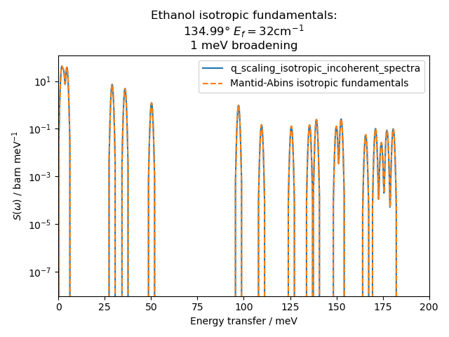
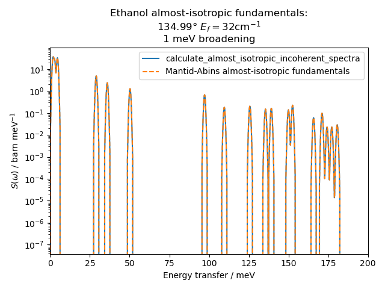
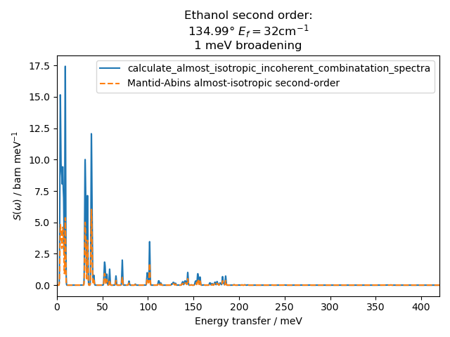

[![Ruff][ruff-badge]][ruff-link]
[![Run tests][ci-badge]][ci-link]
[![License][license-badge]][license-link]

# abinslib
Dynamical structure factor calculations

This is still an experimental playground, please do not use for production.

## Testing and linting

Install with testing dependency group, e.g. from this directory

```
pip install . --group test
```

and run with pytest

```
pytest
```

You may need to update Pip to access the `--group` feature.

New code should be accompanied with appropriate tests; use

`pytest --cov --cov-report term-missing`

to get a breakdown of which lines are not covered by tests. (This can
also be found in the Github Actions output when making a Pull Request.)
As well as unit testing, code contributions must pass linting with
`ruff check` and `ruff format`.

The *pytest-regressions* package is used to create/test reference
outputs for functions given particular input. This gives confidence
that results do not change unexpectedly between versions, but such
["regression tests"](https://en.wikipedia.org/wiki/Regression_testing)
are not necessarily validated against an ideal or external reference.

## Validation status

So far we have implemented the simplest possible calculation from
Mantid-Abins: a 1D fundamental spectrum in the fully-isotropic
approximation. This is benchmarked against the equivalent calculation
in Mantid by a Snakemake workflow in *dev/validation*:





To reproduce the result so closely it was necessary to apply similar
implementation details: the `q_scaling_isotropic_incoherent_spectra`
function computes mode intensities at Q = 1Å and bins them to a dense
spectrum before applying Q^n2/n! scaling and Debye—Waller factor for
the bin-centre Q values. In practice this gives an acceptable
discretisation error of ~0.1%.

Another minor discrepancy comes from the neutron scattering
cross-section references.


[ruff-badge]: https://img.shields.io/endpoint?url=https://raw.githubusercontent.com/astral-sh/ruff/main/assets/badge/v2.json
[ruff-link]: https://github.com/astral-sh/ruff
[ci-badge]: https://github.com/pace-neutrons/abinslib/actions/workflows/test.yml/badge.svg
[ci-link]: https://github.com/pace-neutrons/abinslib/actions/workflows/test.yml
[license-badge]: https://img.shields.io/badge/License-GPLv3-blue.svg
[license-link]: https://www.gnu.org/licenses/gpl-3.0
